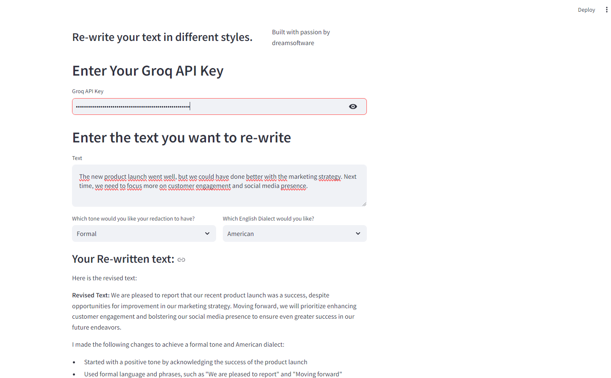
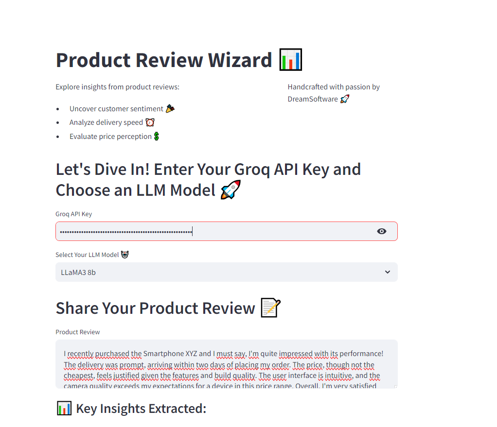
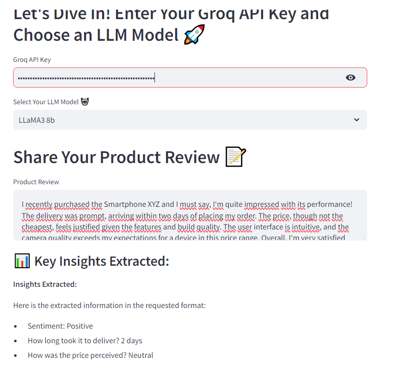
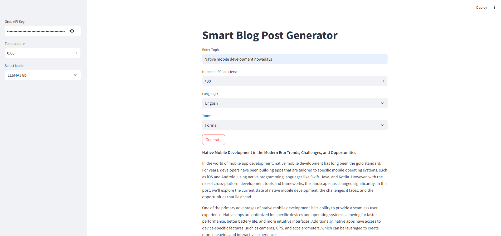
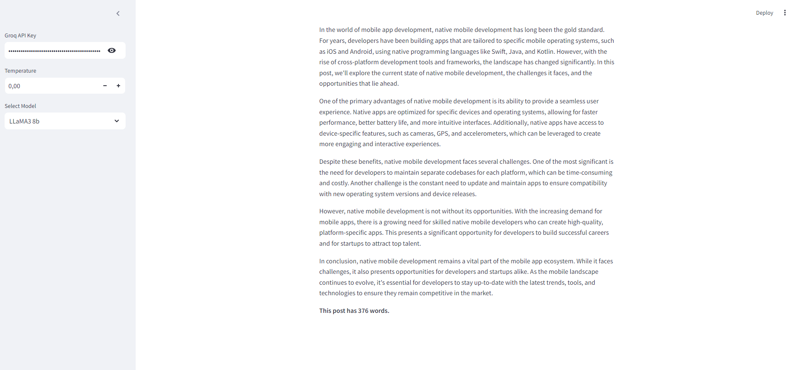
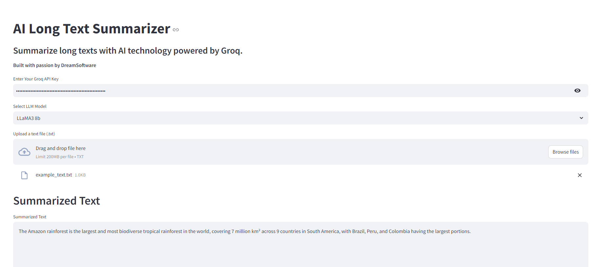
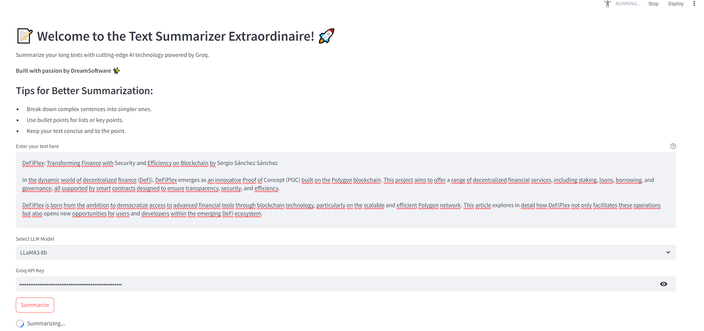

# Streamlit LLM: Transformative AI Applications 🌟

Welcome to the Streamlit LLM Applications Showcase! This repository contains several Proof of Concept (POC) applications utilizing open-source LLM (Large Language Model) models, powered by Groq for cloud inference and orchestrated using LangChain framework. These applications are designed with Streamlit for interactive user interfaces.

## Projects Overview 📋

### 1. streamlit-dynamic-writing-assistant 💬

**Purpose:** This application serves as a dynamic writing assistant leveraging LLM models. It assists users in generating coherent and contextually relevant text based on prompts provided. Ideal for content creators, writers, and anyone needing AI-powered assistance with text generation.

**Advantages:**
- Utilizes Groq for efficient cloud-based inference 🌐
- LangChain framework orchestrates model interactions seamlessly 🛠️
- Streamlit offers a user-friendly interface for interactive use 🖥️

### 2. streamlit-extract-json-from-review 📝

**Purpose:**
Extracts key information from product reviews using LLM models. It identifies sentiments, delivery times, and price perceptions from user-provided reviews. This POC showcases the capability to extract structured insights from unstructured text data.

**Advantages:**
- Enables structured data extraction from unstructured text using Groq 🌐
- LangChain simplifies the integration and orchestration of LLM models 🛠️
- Streamlit provides an intuitive interface for inputting reviews and viewing extracted insights 🖥️

### 3. streamlit-smart-blog-post-generator 📚

**Purpose:**
Generates smart blog posts based on user inputs and prompts. This application demonstrates the ability to create informative and engaging blog content using AI-powered language models.

**Advantages:**
- Employs Groq for robust inference capabilities in generating blog content 🌐
- LangChain efficiently manages the workflow of generating blog posts from prompts 🛠️
- Streamlit offers a straightforward interface for users to interact with and generate blog content dynamically 🖥️

### 4. streamlit-split-and-summarize 📄

**Purpose:**
Splits long texts into manageable chunks and summarizes them using LLM models. This application facilitates the processing and summarization of lengthy documents or articles into concise summaries.

**Advantages:**
- Utilizes Groq for efficient splitting and summarization of text 🌐
- LangChain framework manages the splitting and summarization process seamlessly 🛠️
- Streamlit provides a user-friendly interface for uploading texts and viewing summaries 🖥️

### 5. streamlit-text-summarization 📑

**Purpose:**
Summarizes long texts into key insights using LLM models. It condenses lengthy documents or articles into digestible summaries, suitable for quick review or analysis.

**Advantages:**
- Harnesses Groq for effective text summarization tasks 🌐
- LangChain orchestrates the summarization workflow using LLM models 🛠️
- Streamlit offers an interactive interface for inputting texts and displaying summaries 🖥️

