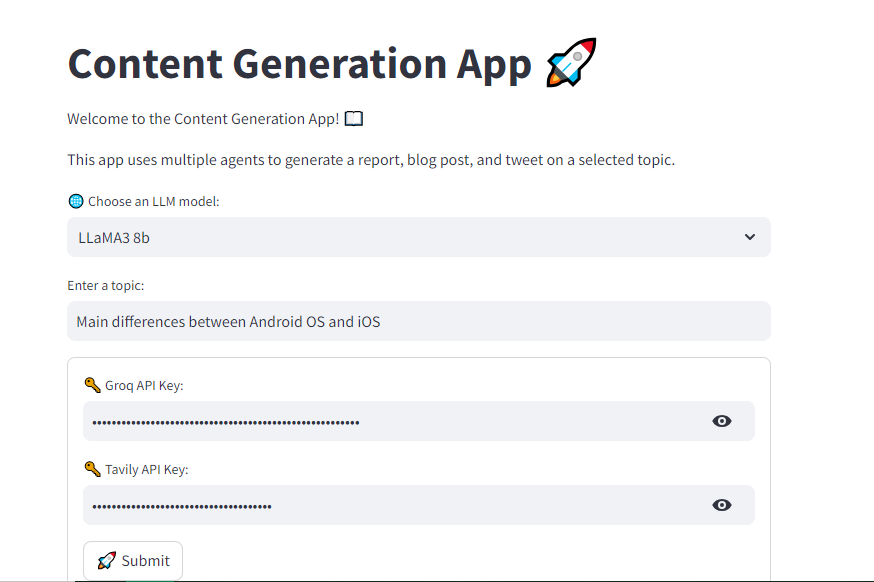

# Streamlit LLM: Transformative AI Applications 🌟

Welcome to the Streamlit LLM Applications Showcase! 🚀

This repository features several Proof of Concept (POC) applications that leverage open-source LLM (Large Language Model) models. These models are powered by **Groq** for cloud inference and orchestrated using the **LangChain** framework. Our applications are designed with **Streamlit** to provide interactive and engaging user interfaces.

## Key Highlights:

- **🧠 Advanced LLM Models:** Utilizing state-of-the-art models like **LLaMA3** and **Mixtral** for various NLP tasks, ensuring cutting-edge performance in language understanding and generation.
- **☁️ Groq Cloud Inference:** Harnessing the power of **Groq** for efficient and high-performance model inference, enabling rapid and scalable AI solutions.
- **🔗 LangChain Orchestration:** Seamlessly managing multi-agent workflows with the **LangChain** framework, facilitating smooth and coordinated interactions between different components of our applications.
- **💻 Interactive UIs with Streamlit:** Offering user-friendly and dynamic interfaces for real-time interaction and feedback, making AI accessible and practical for users of all levels.

## Evaluation with creai:

In addition to showcasing the capabilities of these applications, we also employ **creai** to rigorously evaluate the performance and capacity of our agents. This ensures that each agent not only performs its designated tasks efficiently but also meets high standards of accuracy and reliability.

**creai** allows us to:

- **📝 Assess Performance:** Conduct thorough evaluations of agent responses to ensure they meet expected quality and relevance standards.
- **🔍 Identify Improvements:** Highlight areas where agents can be fine-tuned or enhanced for better performance and user satisfaction.
- **📊 Provide Insights:** Offer detailed reports and insights on agent capabilities, helping us to continually improve and refine our models.

## Explore the POC Applications:

Discover how transformative AI can be applied across various domains through our diverse range of POC applications. Whether you're interested in:

- **🖋️ Content Generation:** Creating high-quality articles, blog posts, or social media content.
- **📈 Data Analysis:** Analyzing complex data sets to extract valuable insights and trends.
- **📲 Social Media Management:** Crafting engaging posts and managing online presence with AI-driven tools.

The showcase provides a glimpse into the future of AI-driven solutions, demonstrating the potential and versatility of advanced language models.

Explore, interact, and experience the power of AI like never before.

## Projects Overview 📋

### 1.streamlit-dynamic-writing-assistant 💬

## Purpose:
The **Streamlit Dynamic Writing Assistant** is a cutting-edge application designed to be your intelligent writing companion. Leveraging advanced LLM (Large Language Model) models, this tool helps users generate coherent, contextually relevant text based on provided prompts. It's perfect for content creators, writers, marketers, and anyone in need of AI-powered assistance for text generation. ✍️✨

## Key Advantages:

- **⚡ Efficient Cloud-Based Inference with Groq:** Harnessing the power of Groq for fast and reliable cloud-based model inference ensures high-performance text generation.

- **🔗 Seamless Orchestration with LangChain:** The LangChain framework orchestrates interactions between different models and tools, providing a smooth and integrated user experience.

- **🖥️ User-Friendly Interface with Streamlit:** Streamlit offers an intuitive and interactive interface, making it easy for users to input prompts and receive AI-generated content in real-time.

## Why Choose This Writing Assistant?

- **🔍 Contextually Aware:** Generates text that is not only grammatically correct but also contextually appropriate, maintaining the flow and relevance of the content.
  
- **🌐 Versatile Applications:** Whether you need to write articles, social media posts, marketing copy, or creative stories, this assistant adapts to various writing needs.

- **🚀 Productivity Booster:** Save time and enhance your productivity by letting the AI handle the initial drafting, allowing you to focus on refining and perfecting your content.

## Integration with LangChain

Here's a brief extract from our codebase demonstrating how LangChain has been seamlessly integrated to orchestrate model interactions:

```python
from langchain.tools import tool
from langchain_groq import ChatGroq
from langchain_community.tools.tavily_search import TavilySearchResults

# Initialize LLM with Groq model
def initialize_llm(api_key, model_id):
    llm = ChatGroq(temperature=0, api_key=api_key, model=model_id)
    return llm

@tool("process_search_tool", return_direct=False)
def process_search_tool(url: str) -> str:
    """Used to process content found on the internet."""
    response = requests.get(url=url)
    soup = BeautifulSoup(response.content, "html.parser")
    return soup.get_text()

# Example usage within an agent
llm = initialize_llm(groq_api_key, models[selected_model])
tools = [TavilySearchResults(max_results=1, api_key=taviliy_api_key), process_search_tool]

online_researcher = Agent(
    role="Online Researcher",
    goal="Research the topic online",
    backstory="""Your primary role is to function as an intelligent online research assistant...""",
    verbose=True,
    allow_delegation=True,
    tools=tools,
    llm=llm
)
```


### 2. streamlit-extract-json-from-review 📝

**Purpose:**
Extracts key information from product reviews using LLM models. It identifies sentiments, delivery times, and price perceptions from user-provided reviews. This POC showcases the capability to extract structured insights from unstructured text data.

**Advantages:**
- Enables structured data extraction from unstructured text using Groq 🌐
- LangChain simplifies the integration and orchestration of LLM models 🛠️
- Streamlit provides an intuitive interface for inputting reviews and viewing extracted insights 🖥️


### 3. streamlit-smart-blog-post-generator 📚

**Purpose:**
Generates smart blog posts based on user inputs and prompts. This application demonstrates the ability to create informative and engaging blog content using AI-powered language models.

**Advantages:**
- Employs Groq for robust inference capabilities in generating blog content 🌐
- LangChain efficiently manages the workflow of generating blog posts from prompts 🛠️
- Streamlit offers a straightforward interface for users to interact with and generate blog content dynamically 🖥️


### 4. streamlit-split-and-summarize 📄

**Purpose:**
Splits long texts into manageable chunks and summarizes them using LLM models. This application facilitates the processing and summarization of lengthy documents or articles into concise summaries.

**Advantages:**
- Utilizes Groq for efficient splitting and summarization of text 🌐
- LangChain framework manages the splitting and summarization process seamlessly 🛠️
- Streamlit provides a user-friendly interface for uploading texts and viewing summaries 🖥️


### 5. streamlit-text-summarization 📑

**Purpose:**
Summarizes long texts into key insights using LLM models. It condenses lengthy documents or articles into digestible summaries, suitable for quick review or analysis.

**Advantages:**
- Harnesses Groq for effective text summarization tasks 🌐
- LangChain orchestrates the summarization workflow using LLM models 🛠️
- Streamlit offers an interactive interface for inputting texts and displaying summaries 🖥️


### 6. streamlit-qa-from-document 📄❓

**Purpose:**
This application enables users to perform question-answering (QA) tasks directly from a document. Users can upload a document and ask questions about its content, receiving precise and relevant answers in real-time.

**Key Features:**
- **Document Upload:** Users can easily upload documents in various formats (e.g., PDF, DOCX, TXT) for analysis.
- **Real-time QA:** The app processes the document and provides instant answers to user queries.
- **Advanced NLP Models:** Utilizes state-of-the-art LLM models to understand and extract information from the document.
- **Interactive UI:** Streamlit provides a user-friendly interface for seamless interaction.

**Advantages:**
- **Efficiency:** Quickly retrieves information from large documents without the need to manually search through text.
- **Accuracy:** High precision in answering questions, thanks to advanced LLM models.
- **Versatility:** Supports multiple document formats and diverse types of questions.


### 7. streamlit-evaluate-qa-from-long-document 📚⚖️

**Purpose:**
This application is designed to evaluate the quality and accuracy of question-answering systems when applied to long documents. It helps in assessing how well the QA models perform with extensive texts.

**Key Features:**
- **Long Document Support:** Handles large and complex documents for thorough evaluation.
- **Performance Metrics:** Provides detailed metrics on the accuracy and relevance of answers generated by the QA system.
- **Comparative Analysis:** Allows users to compare the performance of different QA models on the same document.
- **User Feedback:** Incorporates user feedback to refine and improve QA models over time.

**Advantages:**
- **Insightful Evaluation:** Delivers in-depth analysis of QA performance, highlighting strengths and areas for improvement.
- **Model Comparison:** Facilitates the comparison of multiple models to choose the best-performing one.
- **Continuous Improvement:** Utilizes feedback loops to enhance the accuracy and reliability of QA systems.


### 8. streamlit-ask-csv 📊❓

**Purpose:**
This application enables users to perform question-answering tasks on CSV files. It allows users to ask questions about data contained in CSV files and receive structured and insightful answers.

**Key Features:**
- **CSV File Upload:** Users can upload CSV files for analysis.
- **Data Insights:** The app processes the CSV data and provides answers to user queries, offering insights into the data.
- **Advanced Data Processing:** Utilizes powerful LLM models to interpret and extract meaningful information from CSV files.
- **Interactive Dashboard:** Streamlit's interactive interface makes it easy to explore data and ask questions.

**Advantages:**
- **Data Accessibility:** Makes it simple to query large datasets without requiring advanced SQL knowledge.
- **Speed:** Quickly generates answers and insights from complex CSV data.
- **User-Friendly:** Intuitive interface that caters to users of all technical levels, from data analysts to business users.


### 9. streamlit-crewai-groq-llama3 📝🤖

**Purpose:**
This application leverages multiple AI agents to generate comprehensive content on a selected topic. It can produce a detailed report, a polished blog post, and an engaging tweet, all coordinated through a seamless workflow.

**Key Features:**
- **Topic Selection:** Users can input any topic of interest for content generation.
- **Multi-Agent Collaboration:** Utilizes various agents, each specializing in different aspects of content creation, such as research, blog writing, and social media management.
- **Advanced LLM Models:** Powered by Groq and the LLaMA3 model, ensuring high-quality and contextually relevant content.
- **Creai Evaluation:** Integrates with Creai to rigorously evaluate the performance and capacity of the agents, ensuring accuracy and quality in the generated content.
- **Interactive UI:** Streamlit provides an intuitive and dynamic interface for users to interact with the application.

**Advantages:**
- **Efficiency:** Automates the content creation process, saving time and effort for users.
- **Versatility:** Capable of generating various types of content (reports, blog posts, tweets) on any given topic.
- **High Quality:** Ensures the content is well-researched, SEO-optimized, and engaging, thanks to advanced LLM models and agent collaboration.
- **Continuous Improvement:** Uses Creai for performance evaluation, ensuring the agents continuously improve and deliver top-notch results.

**Workflow:**
1. **Topic Input:** User selects a topic of interest.
2. **Research Agent:** Gathers information and data on the topic from various online sources.
3. **Blog Manager Agent:** Writes a detailed and SEO-optimized blog post based on the research.
4. **Social Media Manager Agent:** Creates a concise and engaging tweet about the topic.
5. **Content Marketing Manager Agent:** Reviews the content for accuracy, relevance, and appropriateness before approval.
6. **Creai Evaluation:** Assesses the performance and effectiveness of the agents' outputs.

This POC demonstrates the powerful synergy between multiple AI agents, advanced LLM models, and a user-friendly interface, offering a comprehensive solution for automated content generation and management.




## Contribution

Contributions to this repository are highly encouraged! If you're interested in adding new features, resolving bugs, or enhancing the project's functionality, please feel free to submit pull requests.

## Get in Touch 📬

This repository is developed and maintained by **Sergio Sánchez Sánchez** (Dream Software). Special thanks to the open-source community and the contributors who have made this project possible. If you have any questions, feedback, or suggestions, feel free to reach out at  [dreamsoftware92@gmail.com](mailto:dreamsoftware92@gmail.com).

## Acknowledgments 🙏

We would like to extend our heartfelt gratitude to the incredible team at **AI acelera** and **Julio Colomer** for their outstanding bootcamp on Generative AI. The comprehensive and insightful materials provided during the bootcamp have been instrumental in the development of this project. 

The knowledge and guidance from the AI acelera bootcamp have empowered us to explore the vast potential of generative AI, particularly in the areas of content creation, multi-agent collaboration, and the application of advanced LLM models. 

Thank you for your dedication to advancing AI education and for sharing your expertise with the community. Your efforts have made a significant impact on our understanding and application of generative AI technologies.

## Visitors Count


## Please Share & Star the repository to keep me motivated.
  <a href = "https://github.com/sergio11/streamlit_llm_langchain_applications/stargazers">
     
  </a>
